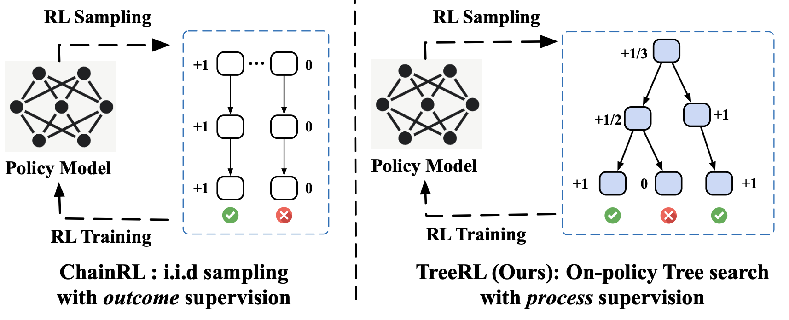
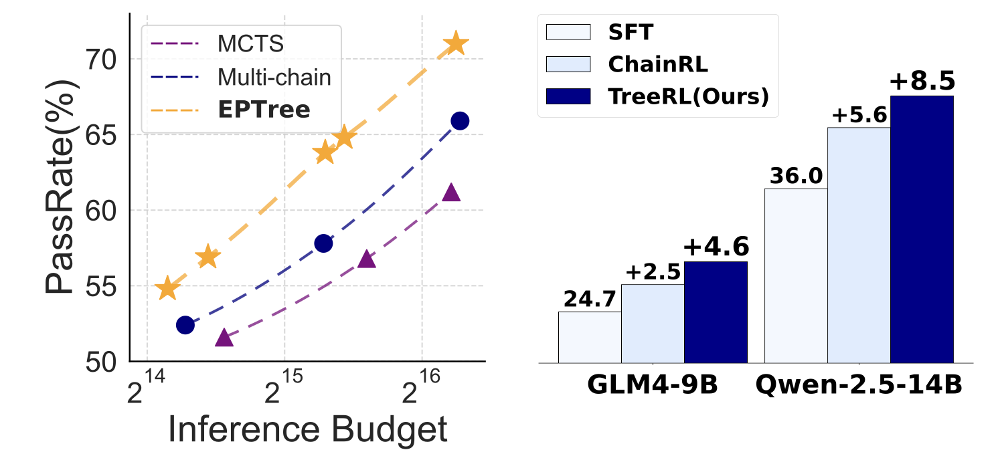
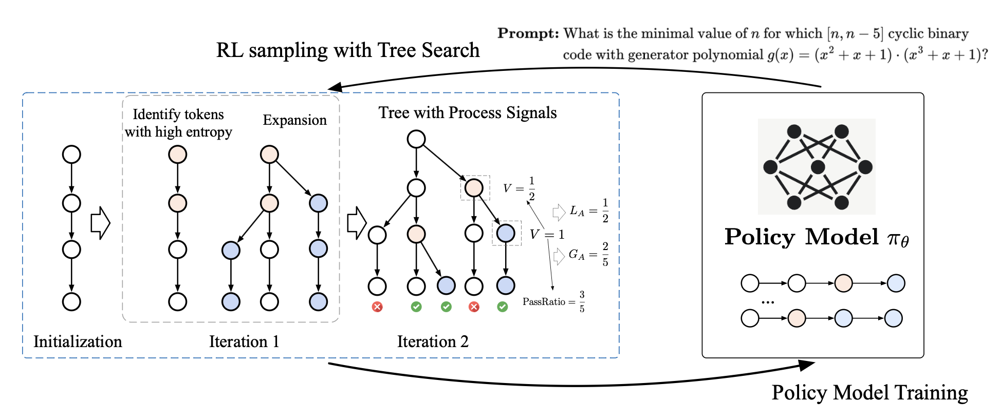

# TreeRL: LLM Reinforcement Learning with On-Policy Tree Search

Implementation for ACL'25 paper [TreeRL: LLM Reinforcement Learning with On-Policy Tree Search](). The implementation is based on [OpenRLHF]()

TreeRL is a reinforcement learning framework that directly incorporates on-policy tree search for training, eliminating the need for separate reward model training while providing better exploration of reasoning space through strategic branching from high-uncertainty steps. Experiments on math and code reasoning benchmarks demonstrate that TreeRL can achieve consistent better performance than ChainRL under the same expeeriment setting.

<p>
  
  <br />
</p>

<p>

</p>

## Getting Started

Currently, we provide the following code of PRIME, you can find more details in each directory.

- `scripts` provides the script to start the training. And the RL implemenration is in `openrlhf`.
- [EPTree](openrlhf/trainer/ppo_utils/entropy_chain_local_manager.py): the tree sampling implementation.
- The training data can be found in `datasets`(datasets). We use the data from [T1](https://huggingface.co/datasets/THUDM/T1) for SFT.

## Experimental Results

| Model                          | MATH500 | Omni-MA | TH-500 | AIME2024 | AMC  | Olympiad Bench | LiveCode Bench | Avg   |
|---------------------------------|---------|---------|--------|----------|------|----------------|-----------------|-------|
| GPT-4o                          | 76.6    | 26.8    | 9.3    | 45.8     | 43.3 | 29.5           | 38.6            | 38.6  |
| Llama-3.1-8B-Instruct           | 52.8    | 15.0    | 10.9   | 22.6     | 15.6 | 11.6           | 21.4            | 21.4  |
| Llama-3.3-70B-Instruct          | 73.9    | 27.9    | 24.2   | 50.9     | 35.7 | 25.5           | 39.7            | 39.7  |
| GLM4-9B-chat                    | 50.1    | 12.9    | 1.7    | 17.2     | 14.7 | 16.5           | 18.9            | 18.9  |
| Qwen-2.5-7B-Instruct            | 76.5    | 26.0    | 13.3   | 41.9     | 35.0 | 16.8           | 34.9            | 34.9  |
| Qwen-2.5-Math-7B-Instruct       | 82.7    | 29.7    | 16.7   | 50.6     | 40.7 | 8.1            | 38.1            | 38.1  |
| Qwen-2.5-14B-Instruct           | 78.9    | 28.7    | 13.7   | 54.5     | 41.8 | 27.7           | 40.9            | 40.9  |
|                                 |         |         |        |          |      |                |                 |       |
| SFT (GLM-9B)                    | 56.0    | 18.2    | 8.3    | 29.2     | 22.5 | 14.2           | 24.7            | 24.7  |
| ChainRL (GLM-9B)                | 63.0    | 21.8    | 6.1    | 31.6     | 23.9 | 16.6           | 27.2            | 27.2  |
| **TreeRL (GLM-9B)**                 | 64.5    | 20.8    | 11.4   | 38.5     | 24.8 | 15.8           | 29.3            | 29.3  |
| SFT (Qwen-2.5-14B)              | 76.6    | 29.5    | 10.6   | 48.0     | 36.9 | 14.5           | 36.0            | 36.0  |
| ChainRL (Qwen-2.5-14B)          | 81.6    | 32.7    | 22.2   | 53.9     | 41.1 | 18.2           | 41.6            | 41.6  |
| **TreeRL (Qwen-2.5-14B)**       | 81.7    | 36.7    | 28.0   | 55.9     | 44.6 | 20.8           | 44.5            | 44.5  |
| SFT (R1-Distilled-Qwen-2.5-7B)  | 94.0    | 47.8    | 55.9   | 85.5     | 54.4 | 43.9           | 63.6            | 63.6  |
| ChainRL (R1-Distilled-Qwen-2.5-7B)| 93.6    | 48.1    | 59.7   | 85.5     | 54.5 | 46.1           | 64.5            | 64.5  |
| **TreeRL (R1-Distilled-Qwen-2.5-7B)** | 94.4    | 49.8    | 60.8   | 85.0     | 57.1 | 47.4           | 65.8            | 65.8  |

## Citing
If you find this work is helpful to your research, please consider citing our paper:

```
@inproceedings{treerl,
  title={GraphMAE: Self-Supervised Masked Graph Autoencoders},
  author={Hou, Zhenyu* and Hu, Ziniu* and Li, Yujiang* and Lu, Rui* and Tang, Jie and Dong, Yuxiao},
  booktitle={ACL},
  year={2025}
}
```